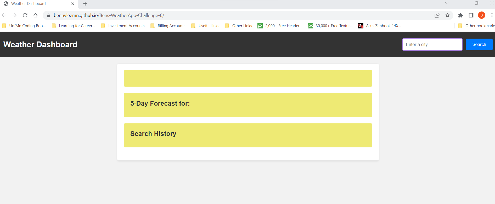
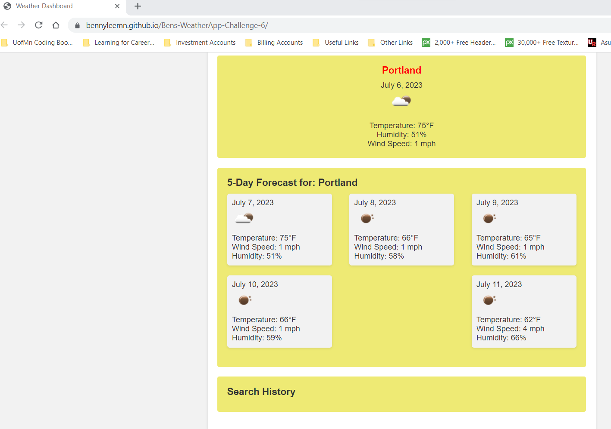

# Bens-WeatherApp-Challenge-6
Weather App/WebSite

Description: Create a simple web application using a weather api to fetch a searched city's current forecast and 5 day forecast. Each searched city will be saved and searchable again by simply clicking on the name in the Search History block on the webpage. I included weather icons in the daily and current forecasts for fun because the api allowed me to.

Link to deployed site: check it out --> [(https://bennyleemn.github.io/Bens-WeatherApp-Challenge-6//)]

Link to repo: [https://github.com/bennyleemn/Bens-WeatherApp-Challenge-6]

Screenshot  
Screenshot  

Contributors: Slack or Discord Study Groups - TA (Akon and Quinton), internet (stackoverflow), prior coursework, additional resources (developer friends) as needed.

Motivation: To continue learning to code using html, css, js, jquery and api's. The syntax in the js file is a little different than i'd been using, learned async functions.

Why did you build this project: To get better acquainted with api usage and jquery and to build my own page from scratch that was better (to me), than weather.com's page (fewer ads ;-))